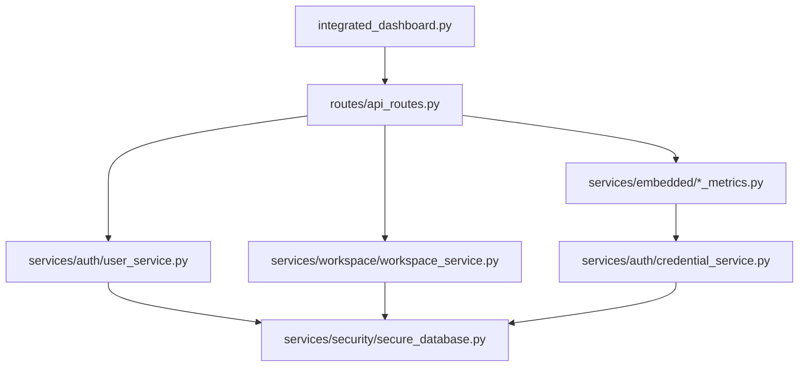

# Current Architecture Snapshot - Pre-Supabase Migration

**Date**: 2026-06-01  
**Commit**: `40894f6 - fix: use Railway volume mount /data for persistent database storage`  
**Purpose**: Complete documentation for rollback reference before Supabase migration  

## ⚠️ CRITICAL ROLLBACK INFORMATION

**Current Working State**: Repository is **CLEAN AND DEPLOYABLE**
- No uncommitted changes affecting core functionality
- Only untracked files are SQLite WAL files (safe to ignore)
- All deployment checks pass ✅
- Repository is in sync with remote origin

### Quick Rollback Command
```bash
git checkout 40894f6
# Restore this exact working state
```

---

## 🏗️ CURRENT DATABASE ARCHITECTURE

### SQLite Database Structure

**Primary Database**: `secure_credentials.db` 
**Location**: 
- Local development: `config/secure_credentials.db`
- Railway production: `/data/config/secure_credentials.db`

#### Tables Schema:

```sql
-- Users table with encrypted sensitive data
CREATE TABLE secure_users (
    id INTEGER PRIMARY KEY AUTOINCREMENT,
    email TEXT UNIQUE NOT NULL,
    display_name TEXT,
    encrypted_password_data BLOB,  -- Encrypted: password_hash, salt  
    workspaces TEXT,               -- JSON array
    role TEXT DEFAULT 'user',
    status TEXT DEFAULT 'active',
    preferences TEXT,              -- JSON object
    created_at TIMESTAMP DEFAULT CURRENT_TIMESTAMP,
    updated_at TIMESTAMP DEFAULT CURRENT_TIMESTAMP,
    last_login TIMESTAMP
);

-- Workspaces metadata
CREATE TABLE secure_workspaces (
    id INTEGER PRIMARY KEY AUTOINCREMENT,
    workspace_id TEXT UNIQUE NOT NULL,
    name TEXT,
    description TEXT,
    settings TEXT,                 -- JSON object
    created_at TIMESTAMP DEFAULT CURRENT_TIMESTAMP,
    updated_at TIMESTAMP DEFAULT CURRENT_TIMESTAMP
);

-- Assignment metadata (no credentials stored here)
CREATE TABLE secure_assignments (
    id INTEGER PRIMARY KEY AUTOINCREMENT,
    assignment_id TEXT NOT NULL,
    workspace_id TEXT NOT NULL,
    name TEXT,
    description TEXT,
    team_size INTEGER,
    monthly_burn_rate INTEGER,
    status TEXT DEFAULT 'active',
    metrics_config TEXT,           -- JSON object WITHOUT credentials
    created_at TIMESTAMP DEFAULT CURRENT_TIMESTAMP,
    updated_at TIMESTAMP DEFAULT CURRENT_TIMESTAMP,
    UNIQUE(assignment_id, workspace_id),
    FOREIGN KEY(workspace_id) REFERENCES secure_workspaces(workspace_id)
);

-- Encrypted credentials storage
CREATE TABLE secure_credentials (
    id INTEGER PRIMARY KEY AUTOINCREMENT,
    workspace_id TEXT NOT NULL,
    assignment_id TEXT NOT NULL,
    connector_type TEXT NOT NULL,  -- 'github', 'jira', 'aws', 'openai'
    encrypted_credentials BLOB NOT NULL,  -- Encrypted credential data
    auth_configured BOOLEAN DEFAULT TRUE,
    created_at TIMESTAMP DEFAULT CURRENT_TIMESTAMP,
    updated_at TIMESTAMP DEFAULT CURRENT_TIMESTAMP,
    UNIQUE(workspace_id, assignment_id, connector_type),
    FOREIGN KEY(workspace_id, assignment_id) REFERENCES secure_assignments(workspace_id, assignment_id)
);

-- Audit logging for security
CREATE TABLE credential_audit (
    id INTEGER PRIMARY KEY AUTOINCREMENT,
    action TEXT NOT NULL,          -- 'create', 'read', 'update', 'delete'
    entity_type TEXT NOT NULL,     -- 'user', 'assignment', 'credential'
    entity_id TEXT NOT NULL,
    user_email TEXT,
    workspace_id TEXT,
    connector_type TEXT,
    success BOOLEAN,
    error_message TEXT,
    ip_address TEXT,
    user_agent TEXT,
    created_at TIMESTAMP DEFAULT CURRENT_TIMESTAMP
);
```

#### Database Statistics (Current):
- **Users**: 0
- **Workspaces**: 0  
- **Assignments**: 0
- **Credentials**: 0

---

## 🔐 CURRENT AUTHENTICATION SYSTEM

### User Service Architecture
**File**: `services/auth/user_service.py`

#### Authentication Flow:
1. **Registration**: 
   - User data stored in JSON files: `config/users/{email}.json`
   - Sensitive password data encrypted in SQLite: `secure_users` table
   - Auto-creates personal workspace
   
2. **Login**: 
   - Validates against encrypted data in SQLite
   - Issues JWT token (HS256 algorithm)
   - Session stored in Flask session + JWT token
   
3. **Authorization**:
   - JWT token verification
   - Workspace-based access control
   - Role-based permissions (user, admin)

#### Security Features:
- **Password Hashing**: PBKDF2-HMAC with SHA256 (100,000 iterations)
- **Encryption**: Fernet encryption for sensitive database fields
- **Audit Logging**: All credential access logged
- **Session Management**: JWT + Flask sessions
- **Workspace Isolation**: Users only access assigned workspaces

### Credential Management
**File**: `services/security/secure_database.py`

#### Encryption Details:
- **Master Key Source**: `CREDENTIAL_MASTER_KEY` env var (with machine-specific fallback)
- **Algorithm**: PBKDF2-HMAC + Fernet (AES 128 in CBC mode)
- **Salt**: Fixed salt `ctodashboard_salt_v1` for key derivation
- **Field-Level**: Only sensitive fields encrypted (passwords, API keys)

#### Storage Strategy:
- **Separation**: Public metadata in JSON, sensitive data in encrypted SQLite
- **Audit Trail**: Every access logged with user/IP/action details  
- **Thread Safety**: Thread-local connections with connection pooling
- **Backup**: WAL mode enabled for better concurrency

---

## 🛠️ CURRENT SERVICE ARCHITECTURE

### Core Application Structure
```
ctodashboard/
├── integrated_dashboard.py        # Main Flask application entry point
├── routes/
│   ├── api_routes.py              # All API endpoints and route logic
│   └── database_admin.py          # Database admin interface routes
├── services/
│   ├── auth/                      # Authentication services
│   │   ├── user_service.py        # User management and JWT
│   │   ├── auth_middleware.py     # Request authentication decorators  
│   │   └── credential_service.py  # Credential retrieval service
│   ├── security/                  # Security and encryption
│   │   ├── secure_database.py     # Encrypted SQLite database manager
│   │   └── credential_manager.py  # Credential encryption utilities
│   ├── workspace/                 # Workspace management
│   │   ├── workspace_service.py   # Workspace CRUD operations
│   │   └── validation.py          # Data validation utilities
│   └── embedded/                  # Metrics collection services
│       ├── aws_metrics.py         # AWS CloudWatch metrics
│       ├── github_metrics.py      # GitHub API metrics  
│       ├── jira_metrics.py        # Jira API metrics
│       ├── openai_metrics.py      # OpenAI API usage metrics
│       └── railway_metrics.py     # Railway deployment metrics
├── config/                        # Configuration storage
│   ├── users/                     # User JSON files (non-sensitive)
│   └── workspaces/                # Workspace configuration files
├── templates/                     # HTML templates
└── static/                        # Static web assets
```

### Service Dependencies


---

## 🚀 CURRENT DEPLOYMENT CONFIGURATION

### Railway.app Deployment
**Environment**: Production
**Domain**: `https://ctodashboard-production.up.railway.app/`

#### Railway Configuration:
- **Runtime**: Python 3.12
- **Database**: SQLite with volume persistence (`/data` mount)
- **Process**: `gunicorn integrated_dashboard:app`
- **Port**: Dynamic allocation (PORT environment variable)
- **Volume**: `/data` for persistent database storage

#### Environment Variables (Production):
```bash
# Database
DB_PATH=/data/config/secure_credentials.db
CREDENTIAL_MASTER_KEY=<encrypted_production_key>

# Authentication  
JWT_SECRET=<production_jwt_secret>
TOKEN_EXPIRY_HOURS=24

# Feature Flags
ENABLE_MULTI_TENANCY=true
ENABLE_WORKSTREAM_MGMT=true
ENABLE_DATABASE=true

# Railway
RAILWAY_ENVIRONMENT=production
PORT=<dynamic>
```

### Local Development
**Database**: `config/secure_credentials.db` (relative path)
**Process**: `python integrated_dashboard.py` 
**Port**: `8520`

---

## 📊 CURRENT DATA ARCHITECTURE

### Data Storage Strategy

#### 1. **User Data** (Dual Storage):
```json
// config/users/{email}.json - Public data only
{
  "email": "user@example.com",
  "display_name": "User Name",
  "created_at": "2024-01-01T00:00:00",
  "workspaces": ["workspace_id"],
  "role": "user",
  "status": "active", 
  "preferences": {
    "default_workspace": "workspace_id",
    "theme": "light"
  }
}

// secure_users table - Encrypted sensitive data
{
  "encrypted_password_data": "<fernet_encrypted_blob>",
  "workspaces": "[\"workspace_id\"]",  // JSON string
  "preferences": "{\"theme\":\"light\"}"  // JSON string
}
```

#### 2. **Workspace Data** (File + Database):
```json
// config/workspaces/{workspace_id}/workspace.json
{
  "id": "workspace_id", 
  "name": "Workspace Name",
  "description": "Description",
  "settings": {},
  "assignments": ["assignment1", "assignment2"]
}

// secure_workspaces table - Metadata mirror
```

#### 3. **Assignment Data** (Hybrid):
```json
// config/workspaces/{workspace_id}/assignments/{assignment_id}.json
{
  "id": "assignment_id",
  "name": "Assignment Name", 
  "metrics_config": {
    "github": {
      "enabled": true,
      "auth_instance": {
        "auth_configured": true,
        "credentials": {}  // EMPTY - actual creds in secure_credentials table
      }
    }
  }
}
```

#### 4. **Credential Data** (Encrypted Only):
```sql
-- secure_credentials table
-- encrypted_credentials BLOB contains:
{
  "github_token": "ghp_xxxxxxxxxxxx",
  "github_org": "orgname", 
  "github_repos": "repo1,repo2"
}
```

---

## 🔌 CURRENT API ARCHITECTURE

### Authentication Endpoints:
```
POST /api/auth/register       # User registration
POST /api/auth/login          # User login + JWT token  
POST /api/auth/logout         # Session cleanup
GET  /api/auth/verify         # Token verification
GET  /api/auth/profile        # User profile data
PUT  /api/auth/profile        # Update user profile
```

### Workspace Endpoints:  
```
GET  /api/workspaces                    # List user workspaces
POST /api/workspaces                    # Create new workspace
GET  /api/workspaces/{id}               # Get workspace details
GET  /api/workspaces/{id}/assignments   # List assignments in workspace
POST /api/workspaces/{id}/assignments   # Create assignment
```

### Assignment Endpoints:
```
GET  /api/assignments                   # List all assignments (legacy)
GET  /api/assignments/{id}              # Get assignment details  
PUT  /api/assignments/{id}              # Update assignment
DELETE /api/assignments/{id}            # Archive assignment

GET  /api/all-metrics/{id}              # Get all metrics for assignment
```

### Metrics Endpoints:
```
GET  /api/aws-metrics                   # Global AWS metrics
GET  /api/github-metrics/{id}           # Assignment GitHub metrics
GET  /api/jira-metrics/{id}             # Assignment Jira metrics
```

### Credential Management:
```
PUT  /api/workspaces/{ws_id}/credentials/{type}        # Set credentials
DELETE /api/workspaces/{ws_id}/credentials/{type}      # Clear credentials
POST /api/workspaces/{ws_id}/credentials/{type}/test   # Test credentials
GET  /api/workspaces/{ws_id}/credentials               # Get credential status
```

---

## 🔧 CURRENT CONFIGURATION SYSTEM

### File-Based Configuration
```
config/
├── users/                    # User public data (JSON files)
├── workspaces/               # Workspace configurations
│   └── {workspace_id}/
│       ├── workspace.json    # Workspace metadata
│       └── assignments/      # Assignment configurations  
│           └── {assignment_id}.json
└── .jwt_secret              # Development JWT secret
```

### Database Configuration
- **SQLite WAL Mode**: Better concurrency, atomic writes
- **Foreign Key Constraints**: Enforced referential integrity  
- **Indexes**: Optimized for common query patterns
- **Audit Trail**: Complete access logging for compliance

### Environment-Based Settings
```python
# Feature Flags
FEATURE_FLAGS = {
    "multi_tenancy": os.getenv("ENABLE_MULTI_TENANCY", "false").lower() == "true",
    "workstream_management": os.getenv("ENABLE_WORKSTREAM_MGMT", "false").lower() == "true", 
    "service_config_ui": os.getenv("ENABLE_SERVICE_CONFIG_UI", "false").lower() == "true",
    "database_storage": os.getenv("ENABLE_DATABASE", "false").lower() == "true"
}
```

---

## 🧪 CURRENT TESTING STRATEGY

### Validation Pipeline
**File**: `pre_deploy_check.sh`

#### Deployment Gates:
1. **Python Syntax Check**: All `.py` files validated
2. **Import Validation**: Missing dependencies detected  
3. **Route Decorator Check**: No orphaned decorators
4. **Init File Check**: Package structure validated
5. **Feature Flag Check**: Consistent flag definitions
6. **Static Analysis**: Code quality validation  
7. **Requirements Check**: All dependencies present

### Test Endpoints:
```
GET  /health                           # Application health check
GET  /debug/auth                       # Authentication system status  
GET  /debug/force-init                 # Emergency database initialization
```

---

## 📈 CURRENT MONITORING & OBSERVABILITY

### Health Monitoring:
```json
// GET /health response
{
  "status": "healthy",
  "timestamp": "2024-01-01T00:00:00", 
  "services": {
    "github": "configured|not_configured",
    "jira": "configured|not_configured",
    "aws": "configured|not_configured", 
    "openai": "configured|not_configured"
  }
}
```

### Database Health:
```json
// SecureDatabaseManager.health_check() response
{
  "database_connected": true,
  "encryption_available": true,
  "master_key_configured": true,
  "statistics": {
    "users": 0,
    "assignments": 0, 
    "credentials": 0,
    "audit_logs": 0
  }
}
```

### Audit Logging:
- **User Actions**: Login, registration, profile updates
- **Credential Access**: Create, read, update, delete operations
- **Workspace Changes**: Assignment modifications, credential updates
- **Security Events**: Failed logins, token validation failures

---

## 🏁 CURRENT KNOWN LIMITATIONS

### Technical Debt:
1. **Mixed Storage**: File + Database hybrid creates complexity
2. **Manual Sync**: No automatic sync between JSON files and database
3. **SQLite Limitations**: Single-writer bottleneck for high concurrency
4. **Local File Dependencies**: Railway volume required for persistence

### Security Considerations:
1. **Fixed Salt**: Encryption uses fixed salt (adequate for current scale)
2. **Development Fallbacks**: Machine-specific keys in development 
3. **Token Storage**: JWT in session + localStorage (client-side)

### Scalability Limits:
1. **Single Database**: No horizontal scaling capability
2. **File I/O**: JSON file operations not optimized for high volume
3. **Thread Safety**: Relies on SQLite WAL mode for concurrency

---

## ✅ MIGRATION READINESS ASSESSMENT

### Data Export Capability:
- ✅ **Users**: Can export from `secure_users` table + user JSON files
- ✅ **Workspaces**: Can export from file system + `secure_workspaces` table  
- ✅ **Assignments**: Can export from file system + `secure_assignments` table
- ✅ **Credentials**: Can decrypt and export from `secure_credentials` table
- ✅ **Audit Logs**: Available in `credential_audit` table

### Current Data Volume:
- **Users**: 0 (clean database)
- **Production Impact**: MINIMAL (no data loss risk)
- **Migration Window**: Flexible (no active users)

### Rollback Safety:
- ✅ **Clean Git State**: No uncommitted changes
- ✅ **Tagged Release**: Commit `40894f6` is stable reference point
- ✅ **Database Backup**: SQLite file can be backed up before migration
- ✅ **Config Backup**: File system state documented and exportable

---

**END OF ARCHITECTURE SNAPSHOT**

**Next Steps**: 
1. Backup current SQLite database
2. Export any existing data  
3. Proceed with Supabase migration planning
4. Maintain this snapshot for emergency rollback
