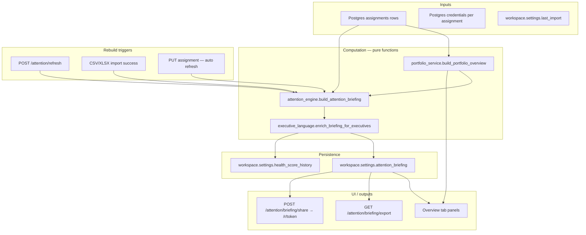

# CTO Briefing Flow — Repo Annotation

**Last updated:** 2026-06-06  
**Purpose:** Source-of-truth map before significant changes to the Daily CTO Briefing.  
**Read with:** `docs/CURRENT-ARCHITECTURE.md`, `docs/portfolio-health-dashboard.md`

---

## What “CTO Briefing” is in this codebase

The **Daily CTO Briefing** is a **deterministic, rule-based executive snapshot** built from workspace assignment rows. It is **not** an LLM product (no OpenAI in the briefing pipeline). It combines:

1. **Portfolio math** — budget variance, connector readiness, health score (`portfolio_service.py`)
2. **Briefing synthesis** — risks, opportunities, narrative, executive bullets (`attention_engine.py`)
3. **Founder-friendly copy** — rewrites messages without changing severity (`executive_language.py`)
4. **Persistence** — stored JSON on the workspace record (`workspace.settings.attention_briefing`)
5. **Presentation** — Overview tab panels, PDF export, public share links

There are **two related but distinct** data paths the UI merges:

| Path | Source | Freshness | Feature flag |
|------|--------|-----------|--------------|
| **Live portfolio** | `GET /api/portfolio/summary` → `build_portfolio_overview()` | Computed on every request | `ENABLE_PORTFOLIO_DASHBOARD` |
| **Stored briefing** | `GET /api/workspaces/{id}/attention/briefing` → `workspace.settings.attention_briefing` | Updated on refresh/import/assignment PUT | `ENABLE_ATTENTION_ENGINE` |

The Overview tab **prefers live data for “Needs Attention”** and **stored briefing for the briefing panel** (narrative, risks, opportunities, share/PDF).

---

## End-to-end flow



---

## Feature flags (Railway / `.env.local`)

| Env var | Default | Effect |
|---------|---------|--------|
| `ENABLE_ATTENTION_ENGINE` | `false` | Briefing API, refresh, share, PDF, import hook, auto-refresh on assignment PUT |
| `ENABLE_PORTFOLIO_DASHBOARD` | `false` | Live `/api/portfolio/summary`, health/details panels, live attention items |
| `ENABLE_CSV_IMPORT` | `false` | Spreadsheet import; on success runs `_run_attention_after_import` |

Both flags are exposed to the dashboard via `GET /api/config` → `flags.attention_engine`, `flags.portfolio_dashboard`.

**Production note:** Briefing UX is most complete when **both** flags are on. With only `ENABLE_ATTENTION_ENGINE`, “Needs Attention” falls back to stored `founder_attention_items` / `risk_signals`.

---

## Module map (change hotspots)

### 1. `services/portfolio_service.py` — foundation layer

Pure computation from assignment dicts. **No I/O, no persistence.**

| Function | Role in briefing |
|----------|------------------|
| `portfolio_summary()` | Counts, burn totals, missing targets |
| `budget_variance()` | Per-assignment and portfolio variance; feeds attention + financial score |
| `connector_health()` | Enabled vs credentialed connectors |
| `attention_center()` | Actionable items: budget_overrun, connector_needs_credentials, missing_target |
| `portfolio_health_score()` | 0–100 overall + financial/connector/delivery components |
| `assignment_ranking()` | CTO priority ordering (Details panel) |
| `build_portfolio_overview()` | Aggregates all six sections |

**Constants:** `VARIANCE_WARN_PCT=10`, `VARIANCE_CRITICAL_PCT=20`, `HEALTHY_MIN=80`, `AT_RISK_MIN=60`.

**Invariant (2026-06):** Delivery score uses only `budget_overrun` and `missing_target` — connector gaps are not double-counted.

### 2. `services/attention_engine.py` — briefing engine (PRIMARY CHANGE TARGET)

| Function | Role |
|----------|------|
| `build_attention_briefing()` | Main entry: assignments → full briefing dict |
| `_risk_signals()` | Extends attention_center + heuristics |
| `_opportunity_signals()` | Budget headroom, automation candidates |
| `_executive_briefing()` | Headline, bullets, delta vs previous refresh |
| `_cto_narrative()` | Paragraph narrative |
| `store_briefing_in_workspace()` / `get_stored_briefing()` | Postgres settings I/O |
| `append_health_score_history()` / `compute_score_trends()` | Score history (52 entries max) |

**Design constraints:** deterministic, no external APIs, graceful empty workspace.

### 3. `services/executive_language.py` — copy layer only

Rewrites text with `executive_framing`. Does **not** change scores or severities.

### 4. Downstream consumers

- `services/briefing_pdf_service.py` — PDF export
- `services/report_share_service.py` — `/r/{token}` public reports
- `services/data_import_service.py` — rebuild after spreadsheet import

---

## Stored briefing JSON (top-level keys)

`generated_at`, `input_fingerprint`, `portfolio_status`, `executive_briefing`, `cto_narrative`, `system_health_score`, `score_trends`, `risk_signals`, `opportunity_signals`, `founder_attention_items`, `portfolio_snapshot`, `import_context`

### Postgres `workspaces.settings` keys

| Key | Purpose |
|-----|---------|
| `attention_briefing` | Full snapshot |
| `health_score_history` | Score trend baseline |
| `last_import` | Import metadata |
| `shared_reports` | Share link snapshots |

No dedicated briefing table.

---

## API surface

| Method | Path | Notes |
|--------|------|-------|
| GET | `/api/workspaces/{id}/attention/briefing` | Stored briefing |
| POST | `/api/workspaces/{id}/attention/refresh` | Rebuild + store |
| GET | `/api/workspaces/{id}/attention/briefing/export` | PDF |
| POST | `/api/workspaces/{id}/attention/briefing/share` | Public link |
| GET | `/api/portfolio/summary?workspace_id=` | Live overview |
| GET | `/r/{token}` | Public report |

Internal: `_refresh_workspace_attention_briefing()` after assignment PUT.

---

## UI (`templates/dashboard.html`)

Overview panels: Needs Attention → Portfolio Health → Portfolio Details → Daily CTO Briefing.

Key JS: `loadOverviewPanels`, `collectAttentionItems`, `renderBriefingPanelBody`, `refreshAttentionBriefing`, `shareBriefingReport`, `exportBriefingPdf`.

---

## Rebuild triggers

| Event | Refreshes briefing? |
|-------|---------------------|
| Refresh button / POST refresh | Yes |
| CSV/XLSX import success | Yes |
| Assignment PUT | Yes (best-effort) |
| Overview page load | No (read only) |
| Connector credential save | **No** (gap) |
| Assignment DELETE | **No** (gap) |

---

## Live vs stored split

| Concern | Live portfolio | Stored briefing |
|---------|----------------|-----------------|
| Needs Attention | Live `attention_center` | Fallback |
| Health score in panel | Live | Can lag |
| Narrative / risks / opps | — | Stored |
| Share / PDF | Stored briefing + portfolio at export time | Yes |

---

## Safe extension points

- New rules in `_risk_signals` / `_opportunity_signals`
- New attention types in `attention_center()` (update health filters if needed)
- Copy in `executive_language.py`
- New rebuild triggers calling `build_attention_briefing` + `store_briefing_in_workspace`

## Avoid

- OpenAI in engine without flag + fallback
- New non-Postgres briefing stores
- Non-deterministic output
- Severity changes in copy layer only

---

## File index

```
services/attention_engine.py      ← engine
services/portfolio_service.py     ← scoring
services/executive_language.py    ← copy
services/briefing_pdf_service.py
services/report_share_service.py
services/data_import_service.py
routes/api_routes.py
templates/dashboard.html
templates/report_share.html
```

---

## Open questions for redesign

1. AI narrative — replace `_cto_narrative`?
2. Live connector metrics in briefing (today: config/credentials only)?
3. Briefing version history beyond score snapshots?
4. Auto-refresh on credential save / delete?
5. Stale share link strategy?
